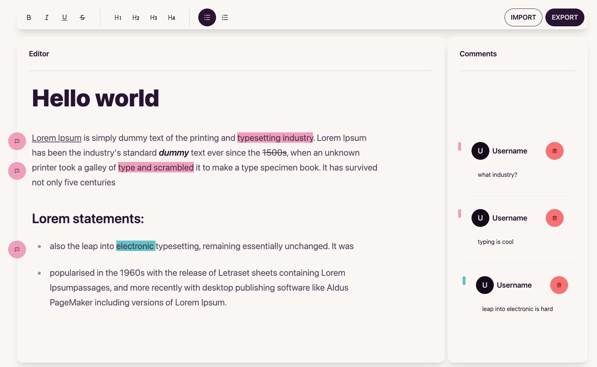

# Fancy Editor



## Description

A cute text editor with commenting capabilities like Google Docs. It also allows you to export code to JSON and import it back.

# Setup the project

## Install dependencies

```bash
$ pnpm install
```

## Run the dev server

```bash
$ pnpm dev
```

## Notes & Todo

I tried my best to implement attaching comments to the position of the highlighted text, but I didn't have time to fix all the visual bugs in a couple of hours. That feature was the most time-consuming thing

- [ ] fix comments highlight bugs
- [ ] implement multi-user editing
- [ ] implement more options for text formatting and adding media (pictures/videos)
- [ ] add artificial intelligence functionality to help with texting
